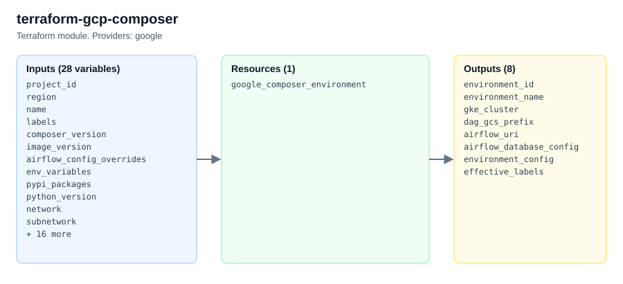

# terraform-gcp-composer

A production-ready Terraform module for managing Google Cloud Composer (managed Apache Airflow) environments with support for Composer 2/3, private networking, custom workloads configuration, PyPI packages, and maintenance windows.

## Architecture



```mermaid
flowchart TD
    A[Terraform Module] --> B[Cloud Composer Environment]
    B --> C[Software Config]
    B --> D[Node Config]
    B --> E[Networking]
    B --> F[Workloads Config]
    B --> G[Security]
    C --> H[Airflow Image Version]
    C --> I[Config Overrides]
    C --> J[PyPI Packages]
    C --> K[Environment Variables]
    D --> L[GKE Cluster]
    D --> M[Service Account]
    E --> N[Private IP]
    E --> O[VPC / Subnet]
    E --> P[IP Allocation Policy]
    E --> Q[Web Server ACL]
    F --> R[Scheduler]
    F --> S[Web Server]
    F --> T[Workers]
    F --> U[Triggerer]
    G --> V[CMEK Encryption]
    G --> W[Master Auth Networks]
    B --> X[Maintenance Window]

    style A fill:#4285F4,stroke:#1A73E8,color:#FFFFFF
    style B fill:#34A853,stroke:#1E8E3E,color:#FFFFFF
    style C fill:#EA4335,stroke:#D93025,color:#FFFFFF
    style D fill:#EA4335,stroke:#D93025,color:#FFFFFF
    style E fill:#FF6D00,stroke:#E65100,color:#FFFFFF
    style F fill:#9C27B0,stroke:#7B1FA2,color:#FFFFFF
    style G fill:#607D8B,stroke:#455A64,color:#FFFFFF
    style H fill:#FBBC04,stroke:#F9AB00,color:#000000
    style I fill:#FBBC04,stroke:#F9AB00,color:#000000
    style J fill:#FBBC04,stroke:#F9AB00,color:#000000
    style K fill:#FBBC04,stroke:#F9AB00,color:#000000
    style L fill:#00BCD4,stroke:#0097A7,color:#FFFFFF
    style M fill:#00BCD4,stroke:#0097A7,color:#FFFFFF
    style N fill:#FF6D00,stroke:#E65100,color:#FFFFFF
    style O fill:#FF6D00,stroke:#E65100,color:#FFFFFF
    style P fill:#FF6D00,stroke:#E65100,color:#FFFFFF
    style Q fill:#FF6D00,stroke:#E65100,color:#FFFFFF
    style R fill:#9C27B0,stroke:#7B1FA2,color:#FFFFFF
    style S fill:#9C27B0,stroke:#7B1FA2,color:#FFFFFF
    style T fill:#9C27B0,stroke:#7B1FA2,color:#FFFFFF
    style U fill:#9C27B0,stroke:#7B1FA2,color:#FFFFFF
    style V fill:#607D8B,stroke:#455A64,color:#FFFFFF
    style W fill:#607D8B,stroke:#455A64,color:#FFFFFF
    style X fill:#81C784,stroke:#66BB6A,color:#000000
```

## Features

- **Composer 2 and 3**: Support for latest Composer versions with configurable image versions
- **Software Configuration**: Airflow config overrides, environment variables, PyPI packages
- **Private Networking**: Private IP environments with VPC peering or Private Service Connect
- **Workloads Config**: Fine-grained CPU, memory, and storage for scheduler, web server, workers, and triggerer
- **Maintenance Windows**: Scheduled maintenance with recurrence rules
- **Web Server ACL**: IP-based access control for the Airflow web UI
- **CMEK Encryption**: Customer-managed encryption keys for environment data
- **High Resilience**: Multi-zone deployment for production workloads

## Usage

### Basic

```hcl
module "composer" {
  source = "path/to/terraform-gcp-composer"

  project_id = "my-project"
  region     = "us-central1"
  name       = "my-airflow-env"
}
```

### With PyPI Packages

```hcl
module "composer" {
  source = "path/to/terraform-gcp-composer"

  project_id = "my-project"
  region     = "us-central1"
  name       = "my-airflow-env"

  pypi_packages = {
    "apache-airflow-providers-slack" = ">=7.0.0"
    "pandas"                         = ">=2.0.0"
    "scikit-learn"                   = "==1.3.0"
  }
}
```

## Requirements

| Name | Version |
|------|---------|
| terraform | >= 1.3 |
| google | >= 5.0 |
| google-beta | >= 5.0 |

## Inputs

| Name | Description | Type | Default | Required |
|------|-------------|------|---------|----------|
| project_id | The GCP project ID | `string` | n/a | yes |
| region | The region | `string` | `"us-central1"` | no |
| name | Environment name | `string` | n/a | yes |
| composer_version | Major Composer version (2 or 3) | `number` | `2` | no |
| image_version | Composer image version string | `string` | `null` | no |
| airflow_config_overrides | Airflow config overrides map | `map(string)` | `{}` | no |
| env_variables | Environment variables | `map(string)` | `{}` | no |
| pypi_packages | PyPI packages to install | `map(string)` | `{}` | no |
| network | VPC network self_link | `string` | `null` | no |
| subnetwork | Subnet self_link | `string` | `null` | no |
| service_account | GKE node service account | `string` | `null` | no |
| enable_private_environment | Enable private IP | `bool` | `false` | no |
| private_environment_config | Private environment settings | `object` | `null` | no |
| maintenance_window | Maintenance window config | `object` | `null` | no |
| environment_size | Environment size | `string` | `"ENVIRONMENT_SIZE_SMALL"` | no |
| scheduler | Scheduler workload config | `object` | `null` | no |
| web_server | Web server workload config | `object` | `null` | no |
| worker | Worker workload config | `object` | `null` | no |
| triggerer | Triggerer workload config | `object` | `null` | no |
| kms_key_name | CMEK key name | `string` | `null` | no |
| labels | Labels map | `map(string)` | `{}` | no |

## Outputs

| Name | Description |
|------|-------------|
| environment_id | The environment ID |
| environment_name | The environment name |
| gke_cluster | The associated GKE cluster |
| dag_gcs_prefix | The GCS DAGs folder prefix |
| airflow_uri | The Airflow web UI URI |

## Examples

- [Basic](examples/basic/) - Simple Composer 2 environment
- [Advanced](examples/advanced/) - Environment with private IP, PyPI packages, and workloads config
- [Complete](examples/complete/) - Full production setup with all features

## License

MIT License - Copyright (c) 2024 kogunlowo123

<!-- project-structure -->
## Project structure

```text
├── .github/
├── docs/
│   └── architecture.html
├── examples/
│   ├── advanced/
│   ├── basic/
│   └── complete/
├── tests/
│   ├── main.tf
│   ├── outputs.tf
│   └── providers.tf
├── .editorconfig
├── .gitattributes
├── .gitignore
├── CHANGELOG.md
├── CODEOWNERS
├── CONTRIBUTING.md
├── LICENSE
├── README.md
├── SECURITY.md
├── data.tf
├── locals.tf
├── main.tf
├── outputs.tf
├── variables.tf
└── versions.tf
```

<!-- architecture -->
## Architecture


